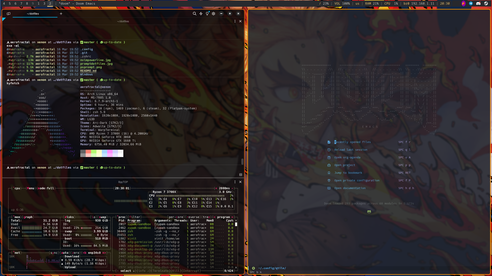

# dotfiles
This is a repo containing my personal Dotfiles for configuration of my shell, prompt, and environment, and window manager on ArchLinux.

## specs

WM: qtile
Bar: polybar
Tray: trayer
File Mangaer: thunar
Terminal: warp-terminal (or Alacritty as an alternative)
Editor: doom-emacs (doom is a collection of packages overhauling standard desktop GNU/Emacs and implementing Evil mode, and making emacs easier to use in a tiling window manager environment.)
Browser: Brave (on flatpak)
Chat: Discord/Telegram (on flatpak)
Email: Thunderbird (on flatpak)
Games: Steam (on flatpak, but I also run a windows VM with an Nvidia 3060 passed through, and I interact with the VM using Spice over looking-glass. I also have Lutris installed locally)
File Manager: Thunar (rarely used)
Run Menu: Rofi

## screenshots

