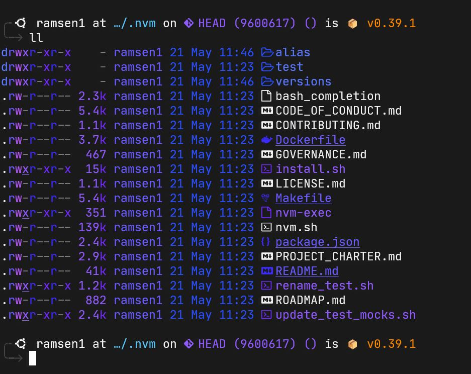
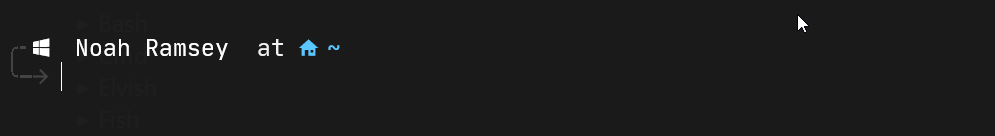
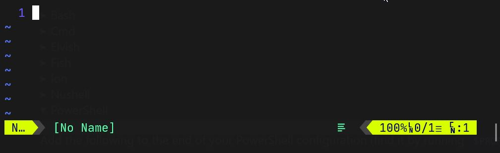

# dotfiles
This is a repo containing my personal Dotfiles for configuration of my shell, prompt, and environment on Ubuntu 20.04 LTS.

## Finished product

### Ubuntu/Linux:



### Windows PowerShell:



### Neovim:



# Table of Contents

- [dotfiles](#dotfiles)
  - [Finished product](#finished-product)
    - [Ubuntu/Linux:](#ubuntulinux)
    - [Windows PowerShell:](#windows-powershell)
    - [Neovim:](#neovim)
- [Table of Contents](#table-of-contents)
- [Pre-requisites](#pre-requisites)
  - [Ubuntu](#ubuntu)
  - [Terminal environment](#terminal-environment)
    - [Font](#font)
    - [Windows Terminal Color Schemes](#windows-terminal-color-schemes)
- [Installation of 'beauty packages'](#installation-of-beauty-packages)
  - [Zsh](#zsh)
  - [Starship](#starship)
    - [Ubuntu/Linux:](#ubuntulinux-1)
    - [Windows PowerShell:](#windows-powershell-1)
- [Configuration](#configuration)
  - [Setting zsh as the default shell](#setting-zsh-as-the-default-shell)
  - [Configuring PowerShell 7](#configuring-powershell-7)
  - [Further configuration](#further-configuration)

# Pre-requisites

## Ubuntu
You will need `NO LATER` than:

* `Ubuntu 20.04.4 LTS`

If you install a version of Ubuntu later than this one, setting up the development environment later in these instructions will not work.

I use Ubuntu on WSL2, whcih can be installed using.
```powershell
PS C:\> wsl --install -d Ubuntu
```
Now the main-line version of Ubuntu for WSL2 is Ubuntu 20.04.4 LTS, but if that changes int the future, you can install it directly by issuing `wsl --install -d Ubuntu-20.04` instead.

## Terminal environment
Since I use Ubuntu on top of WSL2 on Windows, I opted to use `Windows Terminal` instead of the built in command shell/terminal program that comes with WSL2, or the Windows command shell environment.

An important distinction to note is that I am not using the main-line `Windows Terminal` release here, but I am using the `Windows Terminal Preview`, which can be found in the Microsoft Store here: https://www.microsoft.com/store/productId/9N8G5RFZ9XK3

### Font

I am using the `JetBrains Mono NerdFont` in Windows Terminal, which is important because to get the icons in Starship (my zsh prompt) and listings with exa to work, you need a nerdfont with built in icons.

I downloaded the font I use from here:

https://www.nerdfonts.com/font-downloads

### Windows Terminal Color Schemes

Attached to this repository is:

`colorschemes.json`

Which contains code for several colorschemes that [The Digital Life](https://www.youtube.com/c/TheDigitalLifeTech), (my setup is largely pulled from his dotfiles); put together. The link above goes to his YouTube channel, and you can find his code here on GitHub:
* Profile: [@xcad2k](https://github.com/xcad2k)
* Link to his dotfiles repo: [xcad2k/dotfiles](https://github.com/xcad2k/dotfiles)

Go give him some love, and thank him for these awesome dotfiles!

# Installation of 'beauty packages'

## Zsh

Zsh can be installed on Ubuntu by issuing:
```
$ sudo apt install zsh
```
Latest version is fine.

## Starship

Starship can be found at this website: https://starship.rs/

### Ubuntu/Linux:

Installation is done using a variety of different package managers, but I opted to go with the direct installation from their website:
```
$ curl -sS https://starship.rs/install.sh | sh
```

### Windows PowerShell:
On PowerShell 7 using the [Chocolatey Package Manager](https://chocolatey.org/install):
```powershell
PS C:\> choco install starship
```

# Configuration

## Setting zsh as the default shell

```
$ chsh -s /usr/bin/zsh
```

Restart Windows Terminal and re-open Ubuntu. The Zsh initial setup script will run. Choose option `0` to create an empty `.zshrc` file and exit, as we will put my .zshrc in its place.

If you've cloned my Dotfiles repo, now is a good time to put my .zshrc file in your home directory, but do not restart Windows Terminal until you have

`.config/starship.toml`

in place, or Starship will boot as a blank prompt.

## Configuring PowerShell 7

If you've cloned and are using my dotfiles, make sure that `starship.toml` is in a directory in your Home folder labeled `.starship`, like so:

`C:\Users\Noah Ramsey\.starship\starship.toml`

You will add this statement to your `$PROFILE` file for PowerSHell, (you can find my PS profile included in this repo), to invoke Starship:
```powershell
Invoke-Expression (&starship init powershell)
```

## Further configuration

If you are using my Dotfiles, at this point setting up Zsh and Starship are complete. If you'd like to configure Zsh and Starship further, refer to the Zsh documentation, and the Starship website above,

